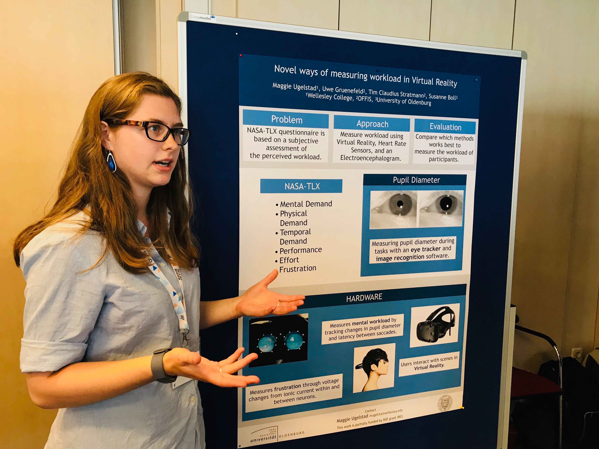

# mugelstad.github.io
My blog from interning in Oldenburg, Lower Saxony, Germany at OFFIS - Institut für Informatik.

# About 
I worked in the Health Division of OFFIS, programming a n-Back Task in an Eye-Tracking Virtual REality headset using C#/Unity. I used a Brain-Computer Interface (EEG) to record stress levels in lieu of the standard paperwork-heavy assessment - the NASA TLX assessment. Furthermore, I worked using openCV software to assess changes in covnitive load for VR applications through pupil dilation. 

## Features of the NASA TLX Assessment

## Poster Presentation

## N-Back Task Video Representation

## Photograph of me in Berlin

